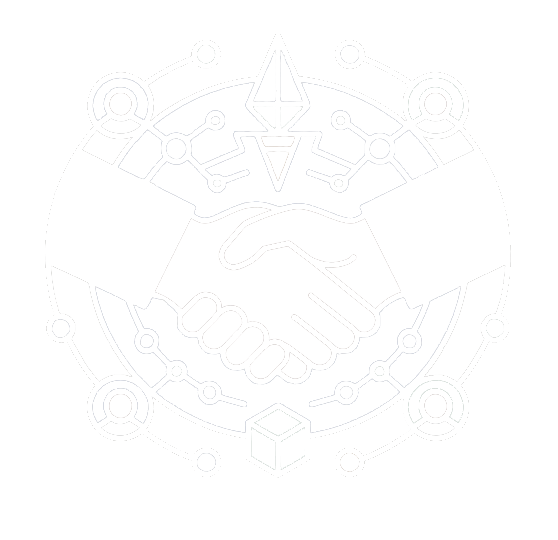

# Cryptolance - AI-Powered Freelance platform

An intelligent freelance marketplace powered by AI agents that automatically match clients with the best freelancers and handles secure payments on the UMI Network blockchain.

<p align="center">
  
</p>

##  Project Overview

Cryptlance revolutionizes freelance work by combining AI-powered matchmaking with blockchain-based automatic payments. The platform uses two intelligent agents:

- **Scout Agent**: Finds the best freelancers for client projects and sends automatic proposals
- **Settlement Agent**: Automatically releases funds to freelancers when work is completed

Built on the UMI Network (EVM-compatible) for fast, secure, and low-cost transactions.

##  Key Features

###  AI-Powered Matching
- **Intelligent Freelancer Discovery**: Scout Agent analyzes project requirements and finds the best-suited freelancers
- **Automatic Proposal Generation**: AI generates and sends personalized proposals to clients
- **Smart Recommendations**: Machine learning algorithms improve matching accuracy over time

###  Seamless Communication
- **Real-time Chat**: Direct messaging between clients and freelancers
- **Project Updates**: Automatic status updates and milestone tracking

###  Automated Payments
- **Escrow System**: Funds are held securely until work completion
- **Automatic Settlement**: Instant fund release when client confirms work completion
- **UMI Network Integration**: Fast, low-cost transactions on EVM-compatible blockchain

###  Secure & Transparent
- **Smart Contract Escrow**: Trustless payment system
- **Dispute Resolution**: Built-in mediation system
- **Transaction History**: Complete audit trail on blockchain

##  System Architecture

```
┌─────────────────┐    ┌─────────────────┐    ┌─────────────────┐
│   Client Web    │    │   Scout Agent   │    │ Settlement Agent│
│   Interface     │◄──►│   (AI Matching) │◄──►│ (Auto Payment)  │
│   (Next.js)     │    │   (Python)      │    │   (Python)      │
└─────────────────┘    └─────────────────┘    └─────────────────┘
         │                       │                       │
         │              ┌─────────────────┐              │
         └──────────────►│   Chat System   │◄─────────────┘
                        │   (Real-time)   │
                        └─────────────────┘
                                 │
                   ┌─────────────────┐
                   │   Supabase      │
                   │   Database      │
                   └─────────────────┘
                                 │
                   ┌─────────────────┐
                   │   UMI Network   │
                   │   (Blockchain)  │
                   └─────────────────┘
```

##  Tech Stack

### Frontend
- **Next.js 14** - React framework with App Router
- **TypeScript** - Type-safe development
- **Tailwind CSS** - Modern UI styling
- **Web3.js/Ethers.js** - Blockchain interaction
- **Socket.io** - Real-time chat functionality

### Backend & AI
- **Python 3.10+** - Core backend language
- **FastAPI** - High-performance API framework
- **GROQ API** - AI/ML processing for intelligent matching
- **Uvicorn** - ASGI server
- **Socket.io** - Real-time communication

### Database & Storage
- **Supabase** - PostgreSQL database with real-time features

### Blockchain
- **UMI Network** - EVM-compatible blockchain
- **Solidity** - Smart contract development
- **Web3 Libraries** - Blockchain integration

##  Prerequisites

- **Node.js** (v18 or higher)
- **Python** (v3.10 or higher)
- **npm** or **yarn**
- **UMI Network wallet** (MetaMask compatible)
- **Git**

##  Installation & Setup

### 1. Clone the Repository

```bash
git clone https://github.com/Suganthan96/CryptoTasks.git
cd CryptoTasks
```

### 2. Environment Configuration

Create a `.env.local` file in the root directory:

```bash
# Supabase Configuration
NEXT_PUBLIC_SUPABASE_URL=your_supabase_project_url
NEXT_PUBLIC_SUPABASE_ANON_KEY=your_supabase_anon_key

# AI Configuration
GROQ_API_KEY=your_groq_api_key

# Blockchain Configuration (UMI Network)
PRIVATE_KEY=your_private_key_for_umi_network
```

### 3. Frontend Setup

```bash
# Install dependencies
npm install

# Start development server
npm run dev
```

The frontend will be available at `http://localhost:3000`

### 4. Backend Setup

#### Install Python Dependencies

```bash
# Create virtual environment
python -m venv venv

# Activate virtual environment
# On Windows:
venv\Scripts\activate
# On macOS/Linux:
source venv/bin/activate

# Install dependencies
pip install -r requirements.txt
```

#### Start Scout Agent

```bash
# Start the Scout Agent (AI Matching & Proposals)
python -m uvicorn src.app.agent.agent:app --reload --host 0.0.0.0 --port 8000
```

#### Start Settlement Agent

```bash
# Start the Settlement Agent (Automatic Payments)
python send_umi_work_done.py
```

##  Environment Variables Reference

| Variable | Description | Required | Example |
|----------|-------------|----------|---------|
| `NEXT_PUBLIC_SUPABASE_URL` | Supabase project URL | Yes | `https://xxx.supabase.co` |
| `NEXT_PUBLIC_SUPABASE_ANON_KEY` | Supabase anonymous key | Yes | `eyJhbGciOiJIUzI1NiIsInR5cCI6IkpXVCJ9...` |
| `GROQ_API_KEY` | GROQ AI API key | Yes | `gsk_...` |
| `PRIVATE_KEY` | UMI Network private key | Yes | `0x...` |

##  How It Works

### 1. Client Posts Project
```
Client creates project → Scout Agent analyzes requirements → AI finds matching freelancers
```

### 2. AI-Powered Matching
```
Scout Agent evaluates freelancers → Generates personalized proposals → Sends to best matches
```

### 3. Communication & Agreement
```
Client reviews proposals → Chats with freelancers → Selects freelancer → Funds escrowed
```

### 4. Work Completion
```
Freelancer delivers work → Client reviews → Says "work done" → Settlement Agent releases funds
```

##  Agent Workflows

### Scout Agent Features
- **Project Analysis**: Uses GROQ AI to understand project requirements
- **Freelancer Matching**: Analyzes skills, experience, and availability
- **Proposal Generation**: Creates personalized proposals automatically
- **Real-time Monitoring**: Continuously monitors for new projects

### Settlement Agent Features
- **Payment Processing**: Handles UMI Network transactions
- **Escrow Management**: Manages funds in smart contracts
- **Automatic Release**: Triggers payment when work is confirmed
- **Dispute Handling**: Manages payment disputes and resolutions

##  UMI Network Integration

### Smart Contract Features
- **Escrow System**: Secure fund holding until completion
- **Dispute Resolution**: On-chain arbitration system
- **Fee Management**: Transparent fee structure

### UMI Network Benefits
- **Fast Transactions**: ~2 second block times
- **Low Fees**: Minimal gas costs
- **EVM Compatible**: Works with existing Ethereum tools
- **Scalable**: High throughput for mass adoption

##  User Interface

### Client Dashboard
- **Freelancer Proposals**: Review AI-generated matches
- **Chat Interface**: Direct communication with freelancers
- **Payment Tracking**: Monitor escrow and payments

### Freelancer Dashboard
- **Project Discovery**: Browse available projects
- **Proposal Management**: Review AI-sent proposals
- **Earnings Tracking**: Monitor payments and balances

##  Development

### Frontend Development
```bash
# Start development server
npm run dev

# Build for production
npm run build

# Run tests
npm test

# Type checking
npm run type-check
```

### Backend Development
```bash
# Start Scout Agent with auto-reload
python -m uvicorn src.app.agent.agent:app --reload

# Run Settlement Agent
python send_umi_work_done.py

```

##  Security

### Best Practices
- **Private Key Security**: Never commit private keys
- **Environment Variables**: Use `.env.local` for sensitive data
- **Smart Contract Audits**: Regular security audits
- **Input Validation**: Sanitize all user inputs
- **Rate Limiting**: Prevent API abuse

### UMI Network Security
- **Multi-signature Wallets**: For large fund management
- **Contract Verification**: All contracts verified on blockchain
- **Gradual Fund Release**: Milestone-based payments
- **Dispute Resolution**: Built-in arbitration system


**Built with ❤️ by team Cryptolance**
